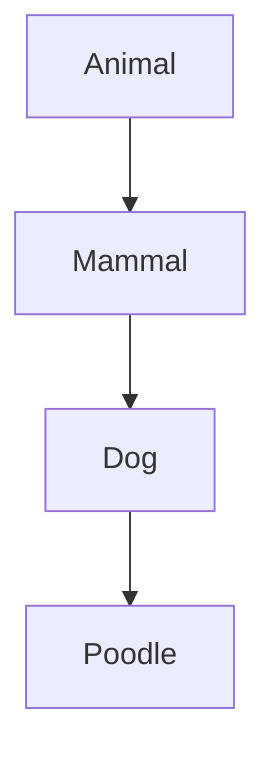
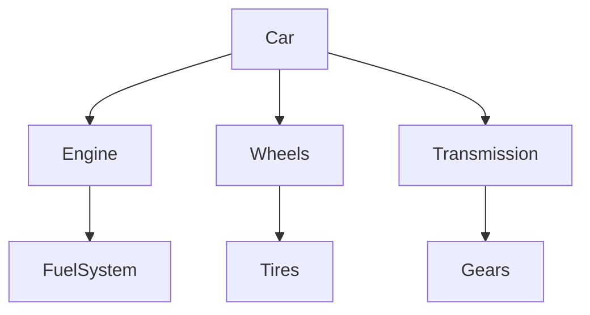

When building software, you’ll inevitably hit a crossroads where you need to decide how your classes should relate to one another. You might be tempted to use inheritance, it's easy and feels intuitive. But hold on! There's a better way to structure your code: composition. In this blog, we’ll explore why you should always choose composition over inheritance, even when it feels like a hierarchy makes sense.

Let’s first break down **inheritance** and **composition** with examples and visuals.

## Inheritance: The Whispering Chain

### What Is Inheritance?

Inheritance creates a *hierarchical* relationship between classes, where a subclass inherits properties and methods from its superclass. The idea is simple: If an object “is a” type of another object, use inheritance.

But inheritance comes with some heavy baggage.

### Example: 

Let’s say we’re modeling animals:



Here, `Poodle` inherits from `Dog`, `Dog` inherits from `Mammal`, and `Mammal` from `Animal`. Looks neat, right? But wait...

### The Whispering Problem

Think of inheritance like a chain of people whispering a message. The message starts as clear as day, but as it’s passed down, it changes slightly or drastically. With each inheritance step, the original behavior may get altered or broken. One change at the top (`Animal`) ripples down, often unintentionally breaking subclasses (`Dog`, `Poodle`). By the time the message reaches the last person, the original meaning might be gone as we didn't have absolute control over individuals.

### Why It’s a Problem

1. **Tight Coupling**: A subclass relies too much on its parent class. If you change one, the others break.
2. **Fragile Base Class**: A small change in a base class (like `Animal`) can have far-reaching, unexpected consequences.
3. **Hierarchical Limitation**: Inheritance locks you into a rigid hierarchy. Need new behavior? You may need to modify the whole chain.

## Composition: Flexible, Like LEGO

### What Is Composition?

Composition takes a different approach: it models relationships as a *has-a* structure. Instead of extending behavior from a parent class, an object is composed of other objects. Think of it as assembling a system out of small, independent pieces (like LEGO blocks).

### Example: 

Instead of inheriting, we create a `Car` that **has** an `Engine`, `Wheels`, and `Transmission`:




In this model, each component is independent. You can modify or swap `Engine` without affecting `Wheels` or `Transmission`. Everything is modular.

### The Whispering Fix

Now, imagine someone gives the message directly to each person in a group, not through a chain. Each person gets the exact same message from the source. This is what composition does: no distortion, no unintended consequences. Each component works in isolation.

### Why It’s Better

1. **Loose Coupling**: Each part of the system is independent, so changes in one don’t automatically break the others.
2. **Reusability**: You can mix and match components in different contexts without rewriting code.
3. **Flexibility**: Need new behavior? Just swap out or add new components without touching the entire system.
4. **Testability**: Each piece can be tested on its own, making debugging much easier.
5. **Hierarchical Relationships**: Even if you need a hierarchy (say, `Animal` and `Mammal`), you can model it with composition to avoid the rigid structure of inheritance.

## Inheritance vs Composition: Quick Comparison

| **Aspect**              | **Inheritance**                                    | **Composition**                                     |
|-------------------------|----------------------------------------------------|-----------------------------------------------------|
| **Relationship**         | "Is-a" (e.g., Dog is a Mammal)                     | "Has-a" (e.g., Car has an Engine)                   |
| **Coupling**             | Tight coupling subclasses depend on superclasses   | Loose coupling components are independent           |
| **Flexibility**          | Rigid changes affect the whole hierarchy           | Flexible components can be swapped independently    |
| **Reusability**          | Limited hard to reuse across different contexts    | High easy to reuse components in different contexts |
| **Modification Risk**    | High changes can break child classes               | Low modifications don’t affect other components     |
| **Testability**          | Harder to test in isolation                        | Easier to test each piece separately                |

## Hierarchy Can Still Work with Composition

Even when you *think* you need inheritance, composition can often do the job better. Take our `Animal` and `Mammal` hierarchy. You can achieve the same relationship using composition:

```python
class Animal:
    def __init__(self, name):
        self.name = name

class Mammal:
    def __init__(self, animal, hair_color):
        self.animal = animal
        self.hair_color = hair_color

dog = Mammal(animal=Animal(name="Rex"), hair_color="Brown")
```

This allows `Mammal` to have the properties of `Animal` without rigid inheritance. Now, if `Animal` changes, you’re not breaking everything downstream.

## Final Thoughts: Composition Wins

So why *never* use inheritance? Because composition gives you the flexibility, reusability, and stability you need in complex systems. Inheritance may look easier at first, but as your codebase grows, it becomes a burden like that game of telephone where no one gets the right message. Moreover, composability **encourages thinking about dependencies** instead of blindly inheriting everything from the parent, ultimately **resulting in reduction**.

**Next time you design a class structure, choose composition.**

---

### TL;DR:
- **Inheritance**: Rigid, tightly coupled, breaks easily.
- **Composition**: Flexible, modular, easy to maintain.
- Avoid the inheritance trap, go for **composition** every time.
