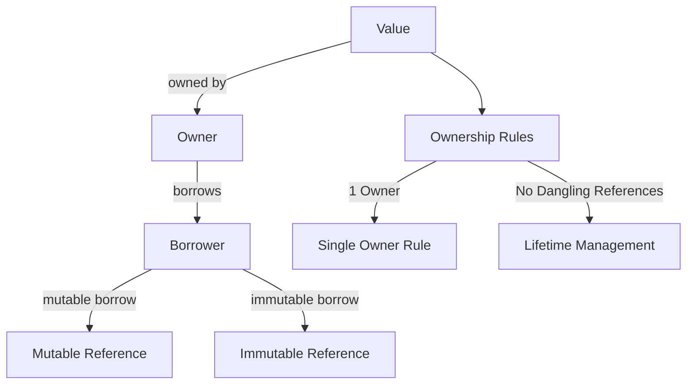

In the world of systems programming, Rust has emerged as a language that combines performance with memory safety, leading to a significant shift in how software is developed. With its adoption even in critical areas like the Linux kernel and support from entities like the US government for safer programming languages, it's clear that Rust is making waves. However, while the hype surrounding Rust is palpable, it might have addressed the wrong or less fundamental problem.

## The Hype vs. Reality of Rust

Rust can achieve **C-like performance** while ensuring memory safety, a combination that has historically been challenging to attain. The language's design focuses on eliminating common memory-related issues such as null pointer dereferencing and data races, which have plagued languages like C and C++. Yet, this strength can also be viewed as a weakness due to the complexity it introduces for developers.

### Memory Safety Without Garbage Collection

One of the most intriguing aspects of Rust is its approach to memory management. Unlike many languages that rely on garbage collection, Rust employs an **ownership and borrowing model**. This model allows for memory safety without the overhead of a garbage collector.

#### How Does It Work?

Rust's ownership model is governed by three core rules:

1. **Each value in Rust has a single owner.**
2. **When the owner goes out of scope, the value is dropped.**
3. **Ownership can be transferred (moved) to another owner.**

This system ensures that there is always a clear understanding of who is responsible for cleaning up resources, thereby preventing memory leaks and other related issues.

### Ownership and Borrowing Explained

To illustrate how ownership works in Rust, let's consider an Entity-Relationship (ER) diagram that represents ownership relationships:

In this diagram:
- Each `OWNER` can own one or more `VALUE` instances.
- A `VALUE` can only have one `OWNER` at any time.

This relationship encapsulates the essence of Rust's ownership model: clear ownership leads to predictable resource management.

### The Borrow Checker

Rust implements its ownership model through a component known as the **borrow checker**. This static analyzer keeps track of where data is used throughout the program, ensuring that ownership rules are adhered to. If any rules are violated—such as trying to mutate data while it’s borrowed—the program fails to compile.

### Complexity in Development

While Rust’s memory management provides significant advantages, it does introduce complexity for developers:

- **Manual Control vs. Safety**: Achieving manual control over memory requires using 'unsafe' Rust, which can lead to vulnerabilities if not handled carefully.
- **Complex Syntax**: The syntax and concepts in Rust can be daunting for newcomers, leading to a steep learning curve compared to other languages where familiar paradigms might apply more intuitively.

For example, consider implementing a doubly linked list in Rust. Each node can only have one owner, creating challenges when managing pointers for previous and next nodes:

- If both `prev` and `next` hold pointers to a middle node, it's breaks the borrowing rules.
- Even though **Arc** (Atomic Reference Counting) supports shared ownership, it introduces performance trade-offs like the overhead of atomic operations and complexities with **weak pointers**, which help avoid cycles but add management overhead.
- Rust enforces rules that prevent simultaneous mutable access, complicating operations like insertion or deletion.

### Conclusion

In summary, while Rust offers remarkable performance and safety features through its unique ownership model, it might have gone the wrong direction i.e. **Reference semantics**.

If Rust ever integrates a garbage collector or completely avoid reference semantics while maintaining its performance characteristics, it would likely become a more universally recommended language among developers seeking both safety and ease of use. Until then, those who prefer simplicity may find themselves at odds with Rust's intricate design philosophy.
