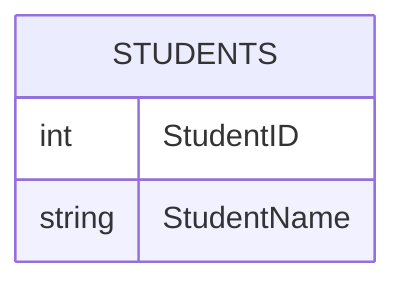
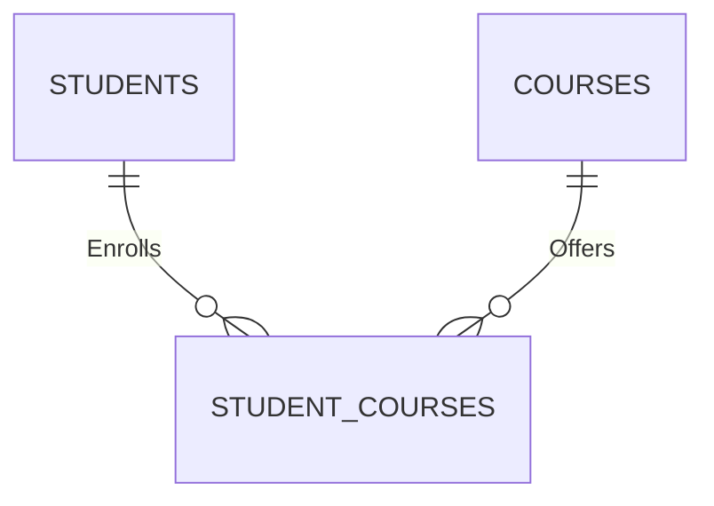

In the realm of database design, the choice between employing junction tables and storing multiple elements in rows for managing many-to-many relationships is a critical one. This decision significantly impacts application performance, data integrity, scalability, and maintainability. Let's explore why junction tables are a superior choice and illustrate this with a practical example.

## The Pitfalls of Storing Multiple Elements in Rows

Storing multiple elements in a single column of a SQL database defies the purpose and principles of relational databases for several reasons:

1. **Violation of First Normal Form (1NF)**
   - Relational databases are designed to follow the principles of normalization, starting with the First Normal Form (1NF). According to 1NF, each cell in a table should contain only atomic (indivisible) values. Storing multiple elements in a single column breaks this rule, leading to data redundancy and potential inconsistencies.

2. **Difficulty in Querying**
   - When data is stored in a non-normalized manner, executing queries becomes more challenging. SQL queries are designed to work efficiently with structured data where each piece of information is stored in its own field. Having multiple elements in a single column complicates the writing of simple and effective queries, as the database engine cannot easily parse and utilize the data.

3. **Indexing Limitations**
   - Indexes play a crucial role in improving query performance by allowing faster data retrieval. However, indexes are most effective when applied to columns that contain single, indivisible pieces of data. Storing multiple elements in a single column makes it difficult to create meaningful indexes, thus hindering the database's ability to optimize query performance.

4. **Data Integrity Issues**
   - Ensuring data integrity is a core goal of relational databases. When multiple elements are stored in a single column, maintaining data integrity becomes more challenging. For example, adding, modifying, or deleting a part of the data requires careful consideration to avoid corrupting the entire set of data stored in that column.

5. **Scalability Problems**
   - As the amount of data grows, the inefficiencies of storing multiple elements in a single column become more pronounced. This approach can lead to scalability issues, as operations such as insertions, deletions, and updates become more complex and time-consuming. Moreover, as the size of the data increases, the performance of the database degrades, affecting the overall system's responsiveness.

6. **Lack of Flexibility**
   - Storing multiple elements in a single column limits the flexibility of the database schema. It becomes difficult to adapt to changes in the data model or to add new attributes without restructuring the entire table, which can be a costly and error-prone operation.

## Example of an Inefficient SQL Schema

Consider a schema where multiple elements are stored in rows. This example illustrates a many-to-many relationship between `Students` and `Courses`.

### Inefficient Schema

In this schema, the `CoursesTaken` field might contain a comma-separated list of course IDs. This design poses several problems, including difficulty in querying specific courses and ensuring data integrity.

## The Advantages of Junction Tables

Junction tables emerge as a superior solution, offering a range of benefits that address the shortcomings of storing multiple elements in rows:

1. **Adherence to Normalization Principles**
   - Junction tables align with normalization standards, ensuring that each piece of data is stored once and referenced elsewhere. This approach minimizes redundancy and maximizes data integrity.

2. **Enhanced Scalability**
   - By separating related data into distinct tables, junction tables facilitate easier management, updates, and queries. This modular structure supports growth and expansion without compromising performance.

3. **Improved Query Performance**
   - Leveraging indexes and foreign key constraints, junction tables enable SQL engines to execute joins efficiently, optimizing data retrieval and manipulation processes.

4. **Flexibility and Future-proofing**
   - Junction tables offer greater flexibility, accommodating changes in the data model with relative ease. This adaptability is crucial for evolving applications and databases.

## Converting to a Junction Table

Let's convert the inefficient schema into a normalized design using a junction table.

### Efficient Schema with Junction Table

In this improved design:
- The `STUDENTS` table stores student information.
- The `COURSES` table stores course information.
- The `STUDENT_COURSES` table acts as a junction table, linking students and courses.

This structure adheres to normalization principles, improving data integrity, scalability, and query performance.

## The Power of Bidirectional Navigation

A critical advantage of junction tables is their capacity to support both forward and backward relations, enhancing the database's navigational capabilities:

- **Forward Relations**: Navigating from one entity to another based on the relationship, facilitating direct access to related data.
- **Backward Relations**: Traversing from the second entity back to the first, enabling comprehensive data analysis and reporting based on relationships.

## Conclusion

The choice between using junction tables and storing multiple elements in rows is not merely academic; it's a practical decision with profound implications for database design, performance, and maintenance. While the initial allure of simplicity might lean towards storing multiple elements in rows, the long-term benefits of using junction tables—such as adherence to normalization principles, scalability, improved query performance, and the ability to support bidirectional navigation—make them the clear winner in managing many-to-many relationships in SQL databases.

In summary, storing multiple elements in a single column in a SQL database contradicts the foundational principles of relational databases, leading to issues with data integrity, querying efficiency, index utilization, scalability, and flexibility. Adhering to normalization principles and avoiding such practices is essential for building efficient, reliable, and scalable database systems.

> This analysis is intended to guide developers and database administrators in making informed decisions regarding their database designs, emphasizing the importance of choosing solutions that prioritize efficiency, scalability, and data integrity.

